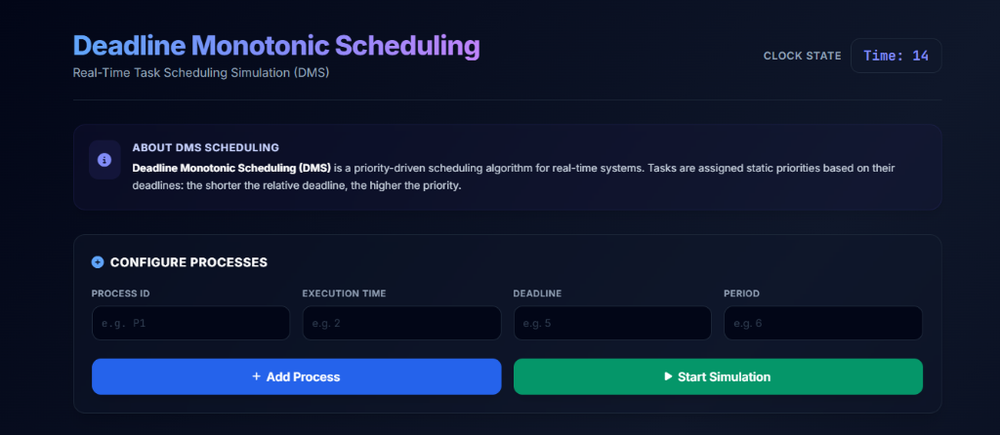
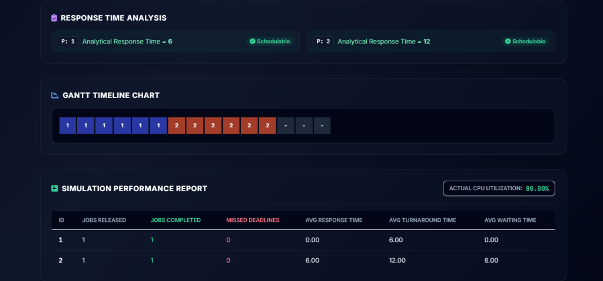

# Deadline Monotonic Scheduling (DMS) Simulator

A real-time, interactive CPU scheduler simulator implementing the **Deadline Monotonic Scheduling (DMS)** algorithm. This project is built as a highly polished, responsive web application designed to demonstrate schedulability analysis and timeline execution for periodic tasks in real-time operating systems (RTOS).

---

## 📌 Project Overview

In real-time systems, task scheduling is critical to ensuring that processes meet their temporal constraints. **Deadline Monotonic Scheduling (DMS)** is a static-priority scheduling algorithm where priorities are assigned to tasks based on their relative deadlines:
* Tasks with **shorter deadlines** are assigned **higher priorities**.
* Tasks with **longer deadlines** receive **lower priorities**.
* It is a preemptive scheduling discipline: a higher priority task will immediately preempt a running lower priority task.

This simulator allows users to customize periodic task sets, check their theoretical schedulability dynamically via Response Time Analysis, execute a step-by-step scheduler simulation over the task set's Least Common Multiple (LCM) period, and generate a performance metrics summary report.

---

## ✨ Features

* **Dynamic Task Configuration**: Add tasks with customized Process IDs, Execution Times, Deadlines, and Periods. Includes client-side validations (e.g. Period $\ge$ Deadline $\ge$ Execution Time).
* **LCM Calculation**: Automatically computes the scheduling boundary period (Least Common Multiple of all task periods).
* **Theoretical Schedulability Analysis**: Real-time evaluation of schedulability using the Response Time Analysis (RTA) recurrence relation:
  $$R_i^{(k+1)} = C_i + \sum_{j \in hp(i)} \left\lceil \frac{R_i^{(k)}}{T_j} \right\rceil C_j$$
* **Strict Priority Tie-Breaking**: Resolves priority ties using standard real-time scheduling conventions (Shorter Deadline ➔ Shorter Period ➔ Alphabetical ID).
* **Dynamic Gantt Chart Timeline**: Visualizes CPU scheduling state step-by-step with color-coded process blocks.
* **Overutilization Warning**: Automatically warns the user if the theoretical CPU utilization exceeds $100\%$, indicating an unschedulable system.
* **Detailed Job Statistics Report**: Generates job metrics upon simulation completion:
  * **Jobs Released vs Completed**
  * **Missed Deadlines Count**
  * **Average Response Time** (time from release to first execution)
  * **Average Turnaround Time** (time from release to completion)
  * **Average Waiting Time** (time spent waiting in the ready queue)
  * **Actual CPU Utilization** (simulation busy time vs total time)

---

## 🛠️ Technologies Used

* **Structure**: HTML5 (Semantic elements)
* **Styling**: Tailwind CSS (Utility-first styling via CDN) & Vanilla CSS (Custom layouts, scrollbars, and keyframe animations)
* **Logic**: Vanilla ES6 JavaScript
* **Icons**: Font Awesome v6

---

## 📂 Folder Structure

```text
dms_scheduler/
│
├── index.html       # Main UI structure and layouts
├── style.css        # Custom scrollbars, Gantt blocks, and keyframe animations
├── script.js        # Core DMS logic, RTA recurrence, job tracking, and simulation loop
└── README.md        # Project documentation (this file)
```

---

## 🚀 How to Run the Project

1. **Clone or Download the Repository**:
   Download the project files onto your local machine.

2. **Open index.html**:
   Double-click the `index.html` file or open it directly in any modern web browser (Google Chrome, Mozilla Firefox, Microsoft Edge, Safari, etc.). No local server or build tools are required!

3. **Simulate a Schedule**:
   * Add a few processes using the configuration panel (e.g. `P1`: Exec=1, Deadline=3, Period=3; `P2`: Exec=2, Deadline=4, Period=5).
   * Click **Start Simulation** to observe the scheduler step-by-step.
   * Review the **Simulation Performance Report** at the bottom once the clock completes.

---

## 📸 Screenshots

*(Place screenshots of your application running here to showcase it on GitHub!)*

1. **Dashboard Interface**
   

2. **Gantt Chart & Simulation Report**
   
